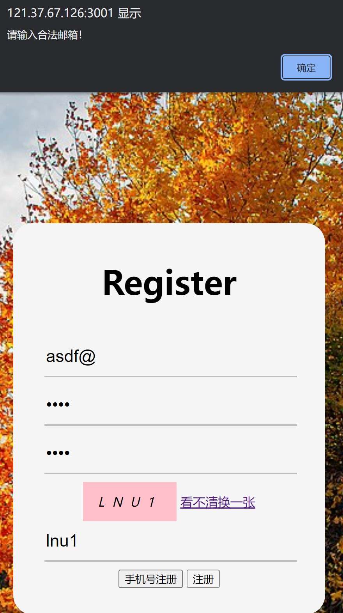
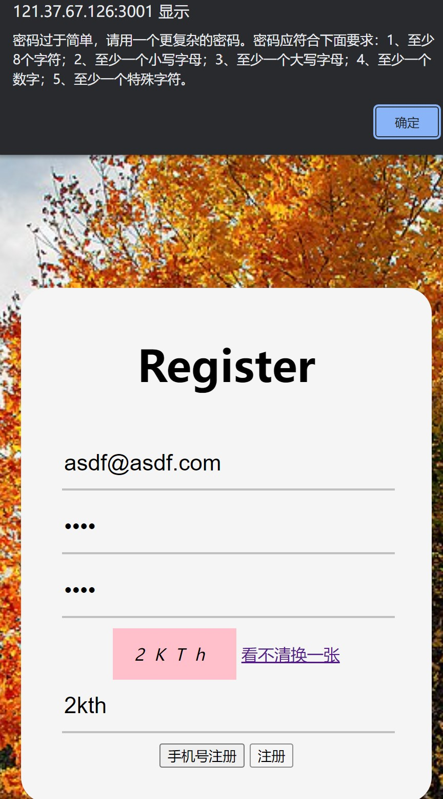
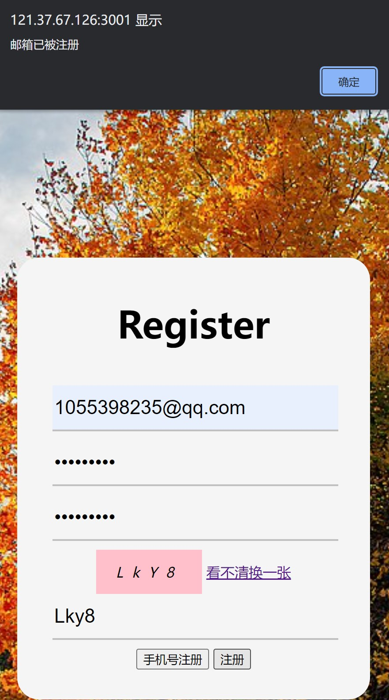
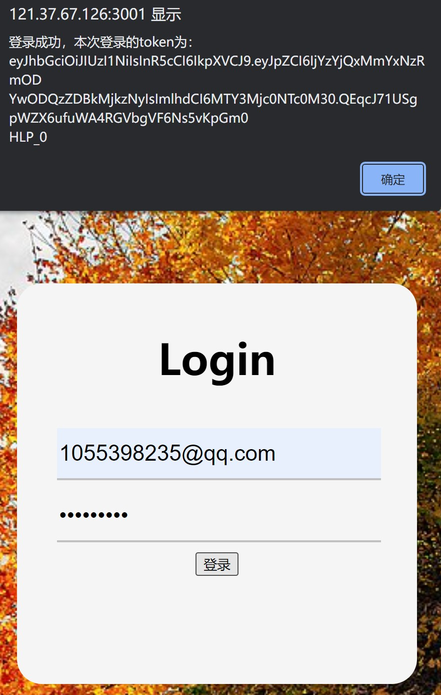
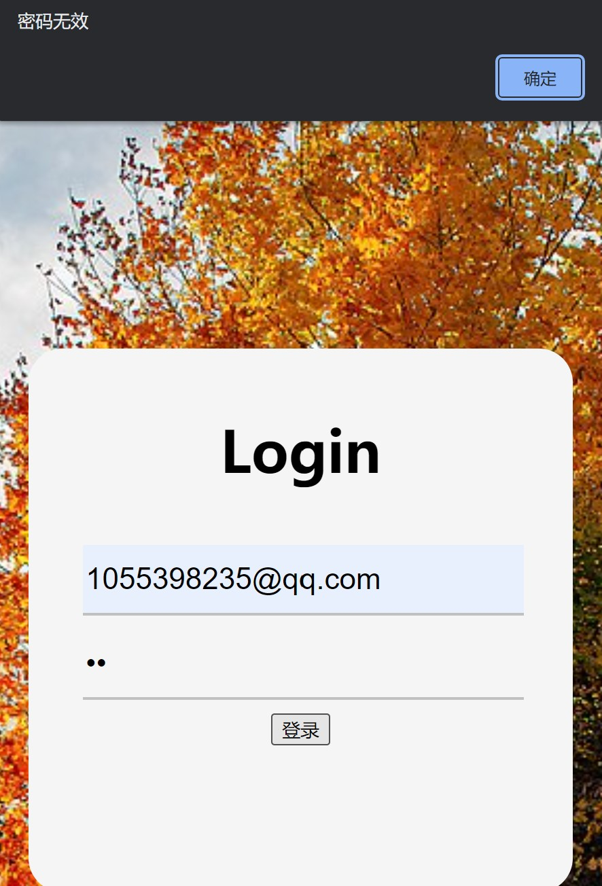

# Assignment 5

## 实现方案

本次作业实现了基于Token的注册登录鉴权方案。

在前后端都对邮箱和密码进行了强度鉴定。

实现了验证码以避免爬虫和恶意攻击。

## 安装

本次作业使用了`express@next`，`bcryptjs`, `jsonwebtoken`, `mongoose`, `password-quality-calculator`, 需要系统中安装mongoDB。可以解压后在根目录运行命令`npm install`以获得依赖。

## 运行过程

命令`node server.js`启动服务。启动后架设在端口3001，即通过[localhost:3001（服务器IP:3001）](localhost:3001)可访问主页index.html，然后点击右上角的登录与注册链接即可注册与登录。

## 运行截图

### 邮箱检查

### 密码强度检查

### 验证码防攻击

### 邮箱已被注册的警告

### 登录成功（显示token仅作示意用，实际不显示）

### 密码错误

## 参考文献

[1、常用密码强度正则表达式](https://www.section.io/engineering-education/password-strength-checker-javascript/)

[2、登录注册功能的设计](https://www.woshipm.com/pd/5417791.html)

[3、一文教你搞定所有前端鉴权与后端鉴权方案，让你不再迷惘](https://juejin.cn/post/7129298214959710244)